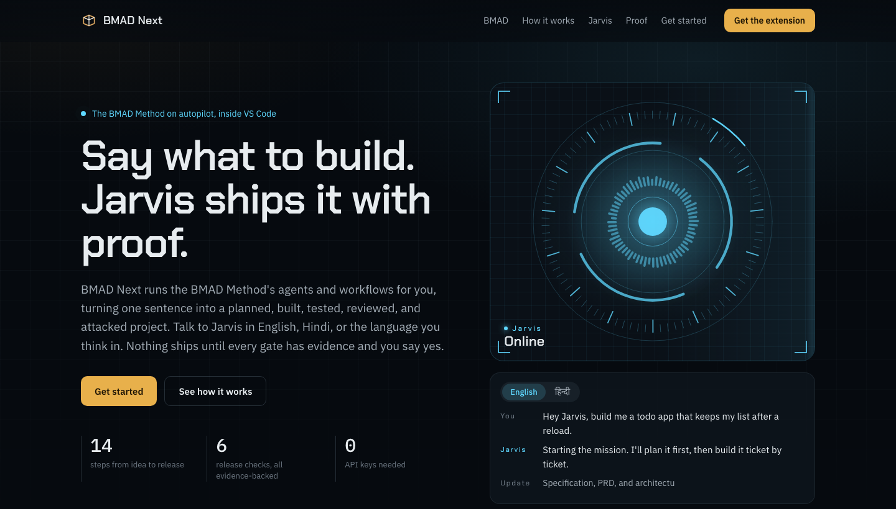
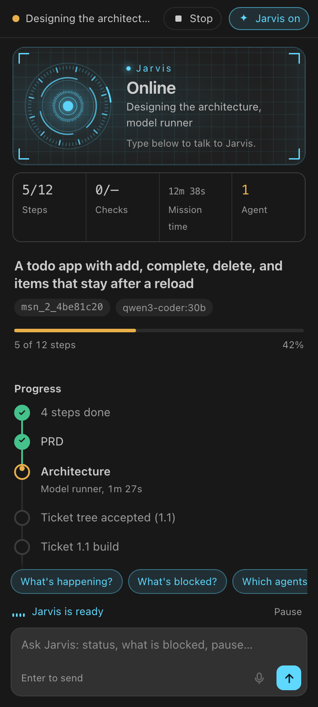
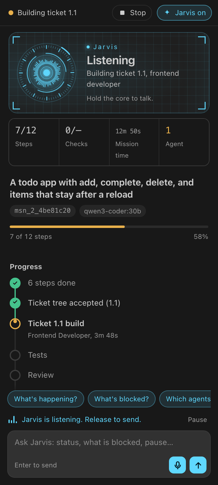
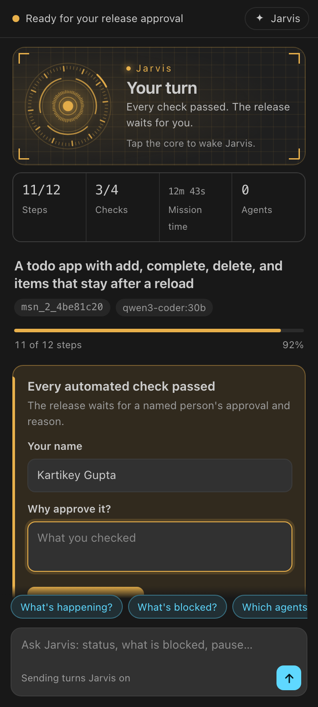
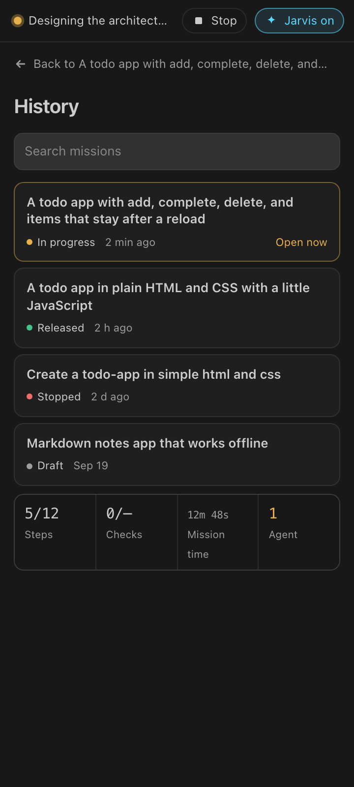
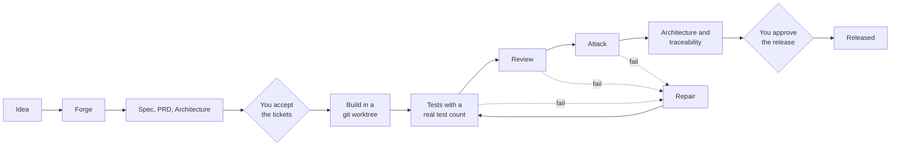

<div align="center">



# BMAD Next

**The BMAD Method on autopilot, inside VS Code.**
Say what to build. Jarvis plans it, builds it, tests it, reviews it, attacks it, and asks you before anything ships.

> Think it. Specify it. Design it. Build it. Break it. Prove it. Ship it. Learn from it.

   

</div>

---

BMAD Next is a control plane for the [BMAD Method](https://github.com/bmad-code-org/BMAD-METHOD). It turns a software idea into a mission, runs BMAD's own agents and skills to plan and build it, and **refuses to call the work done until real runs leave evidence**. A green exit code is not a pass, a model saying "complete" is not a pass, and nothing is released without a named person's approval.

It ships as a **VS Code extension** with a voice co-pilot, **Jarvis**, and as a **CLI harness** that resolves GitHub issues end to end.

## Contents

- [Highlights](#highlights)
- [Quick start](#quick-start)
- [Evaluation (AI Harness Hackathon 2026)](#evaluation-ai-harness-hackathon-2026)
- [The VS Code extension](#the-vs-code-extension)
- [Jarvis](#jarvis)
- [How a mission runs](#how-a-mission-runs)
- [Built on the BMAD Method](#built-on-the-bmad-method)
- [Configuration](#configuration)
- [CLI](#cli)
- [Repository layout](#repository-layout)
- [Development](#development)
- [Troubleshooting and limitations](#troubleshooting-and-limitations)
- [Credits and license](#credits-and-license)

## Highlights

| | |
| --- | --- |
| **Idea to release, on one page** | One panel shows the mission, your next decision, a live progress rail, evidence, and Jarvis. It never reloads under your cursor. |
| **Jarvis, in your language** | Say "Hey Jarvis" and your request, in English, Hindi, Hinglish, or another language. It answers in the language you spoke and narrates what the agents are doing. |
| **Evidence, not claims** | Tests must show a real test count, reviews and attacks must return valid verdicts, and every requirement is traced to the proof behind it. |
| **A team with one job each** | BMAD's planner, builder, reviewer, and attacker work in isolated git worktrees and disagree on purpose. |
| **You make the calls** | Nothing is built until a named person accepts the tickets, and nothing ships until a named person approves the release with a reason. |
| **One API key** | Put `AI_API_KEY` in `.env`. Every agent and Jarvis use it. |

<p align="center">
  
  
  
  
</p>

## Quick start

Requirements: Node.js 22+, npm, git, and an API key for your model provider.

```bash
git clone https://github.com/kartikeyg0104/ai-harness.git
cd ai-harness
echo 'AI_API_KEY=<your-api-key>' > .env
make setup
```

That is the whole setup. Then pick how you want to work:

- **In VS Code:** open this folder and run **Run BMAD Next** from the Run and Debug view. In the window that opens, open the folder for your project (an empty folder with `git init` is fine) and give it the same `.env` with your `AI_API_KEY`. Open the BMAD panel in the activity bar, describe what to build, and press Enter.
- **In the terminal:** run `make run` and paste a GitHub issue URL.

The default model is set in [`harness.config.json`](harness.config.json). To use another provider or model, add `AI_PROVIDER`, `AI_MODEL`, or `AI_BASE_URL` to `.env` (see [Configuration](#configuration)).

## Evaluation (AI Harness Hackathon 2026)

Requirements: Node.js 22+, npm, git, make, and network access.

```bash
git clone https://github.com/kartikeyg0104/ai-harness.git
cd ai-harness
export AI_API_KEY="<PROVIDED_API_KEY>"
make setup   # npm ci (includes the pinned OpenCode runtime), build, optional Chromium
make run     # launch the harness session
make test    # full unit and integration suite, no model calls
make clean   # remove build output and harness workspaces
```

`make run` opens an interactive terminal session. At the `issue>` prompt, give it one of:

| Input | What the harness does |
| --- | --- |
| `https://github.com/<owner>/<repo>/issues/<n>` or `<owner>/<repo>#<n>` | Fetches the issue and its comments, clones the repository into `workspace/`, and resolves the issue in an isolated git worktree |
| `@path/to/issue.md` | Reads the issue text from a file |
| Plain text, ended by a line containing only `.` | Treats the text as the issue, in a new repository or the one set with `repo <url or path>` |

For each issue the harness creates a BMAD mission. With the default `"workflow": "issue"` it runs the lean fix path:

1. The model runner writes a spec.
2. The issue becomes one requirement and one ticket.
3. The repository's tests run once on the untouched worktree (the baseline). If they already fail, for example a Jest `jest.config.ts` that needs an uninstalled `ts-node`, the build prompt carries the failure and a diagnosis, so the fix to the test setup becomes part of the ticket. The reviewer is told that fix is in scope.
4. The coding agent builds the ticket in an isolated git worktree.
5. The repository's own tests run: `npm test`, pytest, `go test`, `cargo test`, or `make test`. In an npm workspace monorepo whose root has no test script, the workspace package that has one runs (`npm test --workspaces --if-present` when several do), and the build prompt names that package, its framework, and its existing test files. Dependencies install with `npm ci` from the repository's lockfile, with lifecycle scripts off; a change that adds a dependency falls back to a lockless install. After the tests pass, each package the change touches runs its own `npm run build` (`tsc`, `next build`), as the repository's CI does; a build failure fails the ticket even when every test passed, and tracked files a build regenerates, such as `next-env.d.ts`, are restored so they never enter the patch. A Python repository gets its own virtual environment under `workspace/.venvs/`.
6. A separate read-only reviewer and attacker inspect the diff. Failures go back to the agent as a repair with the findings, within a retry budget.
7. The architecture and traceability checks run, then the release gate.

`"workflow": "full"` (or `HARNESS_WORKFLOW=full`) uses the adaptive BMAD chain instead: forge, spec, PRD, architecture, ticketing, and so on. The harness stops when a person must decide something, such as accepting the ticket tree or approving the release. An interactive session asks. With `make run AUTO=1` or piped input the harness takes the defaults, and it leaves release approval pending. Results go to `workspace/results/<mission-id>/`: one `ticket-<ref>.patch` per ticket (the change and its tests) plus `summary.json`. The patched worktree stays under `<repo>/.bmad-next/worktrees/`.

Non-interactive options: `make run ISSUE=https://github.com/o/r/issues/1` starts with that issue. `echo "issue text" | make run` runs once and exits. `make run REPO=<url|path>` applies plain-text issues to that repository.

**Provider outages.** A planning step gets three attempts. When all three time out with no reply from the model, the run stops with `Provider blocked: ...` and does not start another pass; a step that answered but missed its output contract still gets one more autopilot pass.

**Model and credential.** The model is defined in [`harness.config.json`](harness.config.json): provider `nvidia`, model `openai/gpt-oss-20b` (text-only), temperature `0`, and a 600 s timeout per model run. `AI_PROVIDER`, `AI_MODEL`, and `AI_BASE_URL` override those fields without editing any file. Set `AI_PROVIDER=openai-compatible` with `AI_BASE_URL` to use any OpenAI-compatible endpoint. The credential is read only from `AI_API_KEY`. The harness writes `.harness/opencode.json` (gitignored), which refers to the key as `{env:AI_API_KEY}`, so the value never reaches disk, a log, or a command line. The coding agent, reviewer, and attacker all use that one model. `GITHUB_TOKEN` is optional; it raises GitHub's anonymous API rate limit.

## The VS Code extension

Open this repository in VS Code (or Code - OSS, or Cursor) and run **Run BMAD Next**. A second window opens with the extension loaded. There, open your project folder: it must be a git repository, because each ticket is built in its own git worktree, and its `.env` holds `AI_API_KEY`.

The BMAD icon in the activity bar opens one panel, top to bottom:

- **Status bar.** What the mission is doing, in plain words ("Designing the architecture", "Waiting for your answer", "Released"), a **Stop** button while it runs, and the Jarvis switch.
- **The Jarvis core.** An animated arc-reactor core that shows Jarvis's state, with telemetry for steps, checks passed, mission time, and working agents.
- **Action card.** Appears only when a person is needed: answer a forge question, accept the tickets, approve the release, or continue after a stop.
- **Progress rail.** Every step of the mission. Finished steps fold away; the running step shows who is working and for how long.
- **Details.** Release checks, tickets, requirements, evidence (open any record), and findings.
- **Conversation.** Jarvis's answers and live updates, with one-tap questions above the composer.
- **Composer.** Describes a new mission when there is none, and talks to Jarvis when there is.

The title bar has **History** (every mission in the project, searchable, one click to open), **New mission** (a clean start screen), and **Run autopilot**.

**Stop means stop.** Stop ends the running step at once: the agent and test processes it started are ended, the step's lock is released, and the stop is recorded. **Continue** retries that step.

Everything the panel does is also a command (`BMAD: New Mission`, `BMAD: Mission History`, `BMAD: Run Mission Autopilot`, `BMAD: Stop Autopilot`, and more), and the `@bmad` chat participant answers from the same state:

```text
@bmad what should I do next?
@bmad build story 1.1
@bmad doctor
@bmad release
```

## Jarvis

Jarvis is the voice of BMAD Next. It acts through the same checked commands as the buttons and answers only from the mission's recorded state.

- **"Hey Jarvis."** Switch on **Hey Jarvis** in the Jarvis core. Say the wake phrase and your request ("Hey Jarvis, build me a pomodoro timer"), and Jarvis wakes and does it. The phrase is recognised in English and Hindi script.
- **Any language.** Speech is transcribed with its language detected. Ask "अभी क्या चल रहा है?" and Jarvis answers in Hindi, in a Hindi voice. Mission ideas are always passed to the builder in clear English.
- **Hands-free.** A two-way conversation without the wake phrase. Jarvis mutes its microphone while it thinks and speaks, so it never answers itself.
- **Push-to-talk.** Hold the Jarvis core or the microphone button, speak, and let go.
- **Live updates.** "The Frontend Developer is building ticket 1.1." "Review found two blocking issues." Translated into the language you are speaking.
- **Full control by voice.** Create a mission, continue, pause, resume, stop, accept the tickets, or approve the release. An approval needs a spoken reason and is recorded under your name. Jarvis never approves on its own.

Typed commands work with nothing more than `AI_API_KEY`. For voice on macOS, add speech recognition once:

```bash
brew install whisper-cpp
mkdir -p ~/.cache/bmad-next/whisper
curl -L -o ~/.cache/bmad-next/whisper/ggml-large-v3-turbo-q5_0.bin \
  https://huggingface.co/ggerganov/whisper.cpp/resolve/main/ggml-large-v3-turbo-q5_0.bin
```

The microphone is open only while **Hands-free** or **Hey Jarvis** is on, and the status bar says so the whole time. macOS asks for microphone permission the first time.

## How a mission runs



| Step | What must be true to pass |
| --- | --- |
| Forge | Who must succeed, what counts as done, and what is out of scope are recorded. |
| Planning | The BMAD skill returns its pinned JSON contract and the named files exist. A skill that writes outside `_bmad-output` is quarantined. |
| Tickets | A named person accepts the ticket tree. |
| Build | The ticket's worktree has a real diff; an empty diff cannot mark a ticket built. |
| Tests | The test command exits 0 **and** reports at least one executed test. |
| Review | A separate reviewer returns valid JSON with passing criteria and no high or critical finding. |
| Attack | An attacker tries to break the change and returns `PASS` without editing the worktree. |
| Architecture, traceability | What was built matches what was declared, and every requirement has a ticket and evidence. |
| Release | Every applicable gate passed and a named person approved with a reason. |

The workflow adapts to the work: a typo stays on spec, build, and review, while a critical product takes the full path, including browser, security, and NFR gates.

## Built on the BMAD Method

[BMAD](https://github.com/bmad-code-org/BMAD-METHOD) is an open-source method for building software with AI agents: named expert roles and step-by-step workflows that carry an idea from analysis to shipped code. BMAD Next runs BMAD's own skills, pinned to BMAD-METHOD commit `5e33d3c` (ahead of release `v6.12.0`), and adds evidence at every gate.

| Loop | BMAD skills and BMAD Next gates |
| --- | --- |
| Think it | Brainstorming, Forge Idea, Deep Recon |
| Specify it | Spec, PRD, Product Brief |
| Design it | UX, Architecture, Epics and Stories |
| Build it | Build, one ticket per git worktree |
| Break it | Code Review, then an adversarial attack |
| Prove it | Real test counts, traceability, NFR evidence |
| Ship it | The fail-closed release gate and your named approval |
| Learn from it | Retrospective and a project brain tied to recorded events |

BMAD's agents each own one job: **Mary** (business analyst), **John** (product manager), **Sally** (UX designer), **Winston** (architect), **Amelia** (developer), and **Murat** (test architect). The installed modules are BMad Method, Core, Test Architecture Enterprise, Creative Intelligence Suite, BMad Builder, and Game Dev Studio.

BMAD Next was itself planned and built with the BMAD Method.

## Configuration

**The only required setting is `AI_API_KEY`.** Everything else has a default.

| Variable | Purpose |
| --- | --- |
| `AI_API_KEY` | Your provider's API key. Read from the environment or `.env`; never written to disk or logs. |
| `AI_PROVIDER` | Provider id (default from `harness.config.json`: `nvidia`). `openai-compatible` works with any OpenAI-compatible API. |
| `AI_MODEL` | Model id (default `openai/gpt-oss-20b`). |
| `AI_BASE_URL` | Endpoint for `openai-compatible`. |
| `HARNESS_WORKFLOW` | `issue` (lean fix path, default) or `full` (the adaptive BMAD chain). |
| `GITHUB_TOKEN` | Optional; raises GitHub's API rate limit when fetching issues. |
| `BMAD_JARVIS_MODEL` | Optional; a different model for Jarvis. |
| `BMAD_WHISPER_MODEL` | Optional; path to the Whisper model used for voice. |

`harness.config.json` holds the default provider, model, temperature, per-run timeout, and workflow. `.bmad-next/config.json` holds autonomy, retry budget, and command policy: assist mode, approval for `git push` and production deploys, and a block on destructive database commands.

<details>
<summary><b>Advanced: runner, reviewer, and attacker contracts</b></summary>

The coding runner, reviewer, and attacker can also be configured one by one, which overrides the single-key setup.

`BMAD_RUNNER` is the executable only. `BMAD_RUNNER_ARGS` is a JSON string array or whitespace-separated arguments, never a shell command; `{prompt}` and `{input}` are replaced by one argument each. `BMAD_MODEL` records the model name, `BMAD_RUNNER_TIMEOUT` is in milliseconds, and `BMAD_RUNTIME=opencode` or `openhands` selects the runtime. A missing command, timeout, non-zero exit, empty reply, invalid JSON, or missing `SPEC.md` leaves the skill incomplete. Processes are spawned with an argument array; `sh -c` is refused.

**Reviewer.** `BMAD_REVIEWER_RUNNER`, `BMAD_REVIEWER_ARGS`, `BMAD_REVIEWER_MODEL`, and `BMAD_REVIEWER_TIMEOUT` follow the same rule. With no reviewer, review evidence stays blocked. A pass needs valid JSON, passing criteria, no high or critical finding, and `.bmad-next/evidence/<mission>/<ticket>-review.json`. `bmad-next repair 1.1` repairs after a failing review or attack; the repair prompt carries each finding and the current diff, then tests and a fresh review run in the same worktree.

**Attacker.** `BMAD_ATTACK_RUNNER`, `BMAD_ATTACKER_ARGS`, `BMAD_ATTACK_MODEL`, and `BMAD_ATTACK_TIMEOUT` never fall back to the coding runner or reviewer. A pass needs valid JSON with status `PASS`, no high or critical finding, an unchanged worktree, and `.bmad-next/evidence/<mission>/<ticket>-attack.json`. High and critical missions require an attack; medium missions do when `attackRiskFloor` is `medium`.

**Browser.** Uses Playwright and Chromium. A scenario belongs to a requirement, navigation stays on `browserOrigins` (`http://127.0.0.1` and `http://localhost` by default), and screenshots are stored as evidence. Browser does not run while the latest attack is `FAIL` or `BLOCKED`.

**Security.** Semgrep, Trivy, and TruffleHog scan the ticket worktree. A missing tool keeps security `NOT CONFIGURED`. High, critical, and secret findings fail the gate; secret text is redacted in the evidence.

**NFR, architecture, traceability.** NFR values come from `BMAD-NFR-VALUE:` lines printed by the verification command. Architecture verification compares declared components and technologies with the repository. Traceability fails when a requirement has no ticket.

**Release.** `bmad-next release approve <mission-id> --by "Name"` or `@bmad approve release by Name` records the approval; `bmad-next release reject` keeps a rejection; "looks good" is not an approval. `release.json` is written only when every applicable gate passes.

**OpenCode.** The coding adapter runs `opencode run --pure --auto --format json` with a finite `steps` bound in `OPENCODE_CONFIG_CONTENT`. A run is complete only after a `step_finish` event whose reason is `stop`.

</details>

## CLI

```bash
npm run build
node packages/cli/dist/main.js doctor
node packages/cli/dist/main.js mission create "Build an expense-management SaaS."
node packages/cli/dist/main.js next
node packages/cli/dist/main.js forge answer "employees of one company"
node packages/cli/dist/main.js forge harden
node packages/cli/dist/main.js stories
node packages/cli/dist/main.js build 1.1
node packages/cli/dist/main.js release
```

Other commands call the same control plane: `mission list|show|resume|pause|cancel`, `autopilot`, `spec`, `prd`, `architecture`, `stories`, `build`, `verify`, `review`, `attack`, `repair`, `security`, `browser`, `nfr`, `evidence list`, `requirements`, `tickets`, `agents`, `timeline`, and `memory`.

**Demo.** `bmad-next demo fresh` creates a separate git workspace in `.bmad-demo`, `bmad-next demo run` answers the forge and builds ticket 1.1, stopping when a gate fails, and `bmad-next demo reset` deletes only `.bmad-demo`. `scripts/demo.sh` runs the whole sequence.

## Repository layout

```text
packages/control-plane   missions, BMAD skills, evidence, gates, and the release rules
packages/cli             the bmad-next command and the issue harness
packages/vscode          the VS Code extension: the panel, Jarvis, and commands
website/                 the product website (open website/index.html)
sources/manifest.json    every upstream project, its pin, license, and boundary
docs/                    architecture, guides, and audits (below)
```

| Document | Covers |
| --- | --- |
| [`docs/QUICKSTART.md`](docs/QUICKSTART.md) | A first mission, step by step |
| [`docs/USER_GUIDE.md`](docs/USER_GUIDE.md) | Running missions day to day |
| [`docs/ARCHITECTURE.md`](docs/ARCHITECTURE.md) | The ticket tree, state machine, and release rules |
| [`docs/DEVELOPER_GUIDE.md`](docs/DEVELOPER_GUIDE.md) | Where to change the control plane |
| [`docs/PROVIDER_GUIDE.md`](docs/PROVIDER_GUIDE.md) | Runtimes and tool availability |
| [`docs/SECURITY.md`](docs/SECURITY.md) | Permissions, redaction, and scan gates |
| [`docs/RELEASES.md`](docs/RELEASES.md) | Effective evidence, approval, and immutability |
| [`docs/EXTENDING_BMAD.md`](docs/EXTENDING_BMAD.md) | Plugins, builder drafts, and modules |
| [`docs/IMPLEMENTATION_STATUS.md`](docs/IMPLEMENTATION_STATUS.md) | What is running, partial, or absent |
| [`docs/TESTING_BMAD_NEXT.md`](docs/TESTING_BMAD_NEXT.md), [`docs/USER_TEST_PLAN.md`](docs/USER_TEST_PLAN.md) | Command-level tests and the manual checklist |

## Development

```bash
npm install
npm run build     # control plane, CLI, and extension
npm test          # 208 unit and integration tests, no model calls
```

After changing the extension, run `npm run build -w bmad-next-vscode` and **Developer: Reload Window** in the extension host.

## Troubleshooting and limitations

- **Something shows `NOT CONFIGURED`, `TIMEOUT`, or `FAILED`.** A missing runtime, browser, or security tool, or a model timeout, is reported as exactly that and never stored as a pass. `bmad-next doctor` prints what is missing.
- **A step keeps failing.** The mission stops at that step and says why in plain words; failed tests, reviews, and attacks go to repair first. You can press **Stop** at any time and **Continue** later.
- **Voice does not start.** Allow VS Code under System Settings, Privacy & Security, Microphone, and check that `whisper-cli` is installed. Typed commands work without voice.
- **Speed** depends on your model provider: a planning step typically takes a minute or two.
- **Optional integrations** (Docker, OpenHands, Semgrep, Trivy, TruffleHog, and observability hosts) stay unconfigured until their tools are installed. Upstream BMAD Loop, BMAD Builder, and TEA execution are not vendored.

## Credits and license

MIT. See [`LICENSE`](LICENSE) and [`THIRD_PARTY_NOTICES.md`](THIRD_PARTY_NOTICES.md).

Built on the open-source [BMAD Method](https://github.com/bmad-code-org/BMAD-METHOD) (MIT) by BMad Code, LLC. BMAD, BMad Method, and BMad Core are trademarks of BMad Code, LLC. BMAD Next is an independent project and does not vendor upstream BMAD source.
